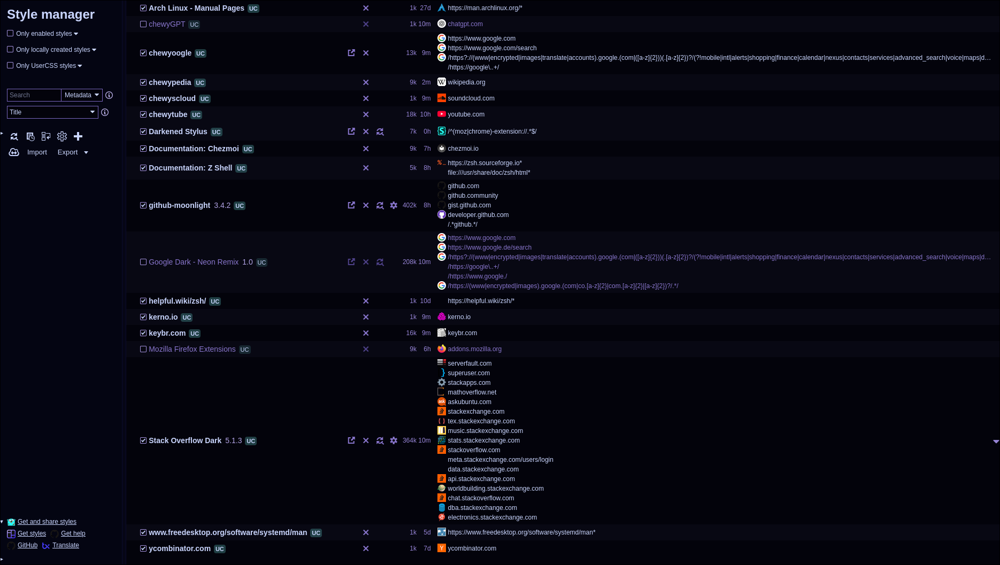

# darkened-stylus

[![stylus-button][]][usercss-darkened-stylus] Styleyou, Styleme, Stylus ^-^

[stylus-button]: <https://img.shields.io/badge/Install%20directly%20with-Stylus-00adad.svg> 'Install directly with Stylus'
[usercss-darkened-stylus]:  <https://raw.githubusercontent.com/chewygumxx/userstyle/main/style/darkened-stylus/darkened-stylus.user.css>

## Screenshots 

<table>
  <tr>
    <td rowspan="2" width="180px"></td>
    <td></td>
  </tr>
  <tr><td></td></tr>
</table>
